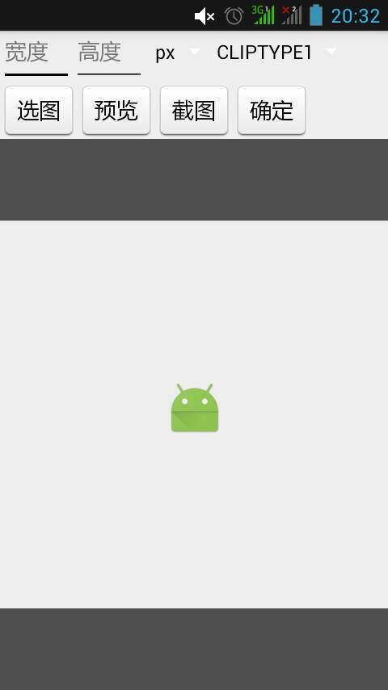
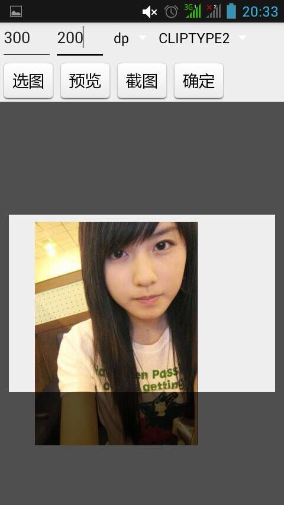
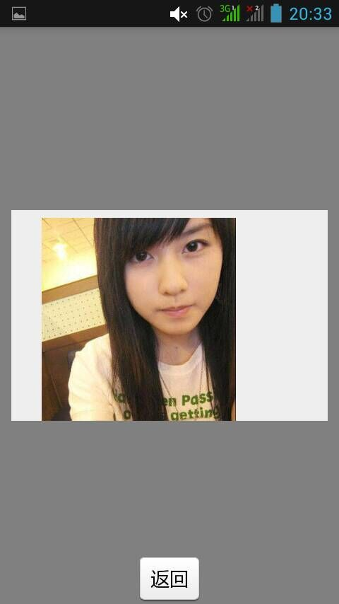

# Android-CustomClipView
A simple package of general cutting picture view.

Features
------------
* Support three clip modes:
* CLIPTYPE1:square
* CLIPTYPE2:fixed rectangle
* CLIPTYPE3:equal proportional rectangle

Sample Project
--------------








Usage
-----
1. Get the resources into your project.

  * import `CustomClipView.java`.
  * import `photoUtil.java` if you need.
  
2. Config in Xml.
  ```xml
  <RelativeLayout
        android:layout_width="match_parent"
        android:layout_height="match_parent" >

        <ImageView
            android:layout_width="match_parent"
            android:layout_height="match_parent"
            android:id="@+id/CustomClipView_iv"
            android:scaleType="matrix" />

        <hxy.ttt.com.customclipview.CustomClipView
            android:layout_width="match_parent"
            android:layout_height="match_parent"
            android:id="@+id/CustomClipView" />

</RelativeLayout>
  ```
  
3. In your Activity, your must implements `View.OnTouchListener` and realization method `onTouch`.
  ```java
  clipview = (CustomClipView) findViewById(R.id.CustomClipView);
  //clipview.setClipParams(400, 400, CustomClipView.CLIPTYPE1);

  Bitmap bm = BitmapFactory.decodeResource(getResources(), R.mipmap.ic_launcher); 
  //String image = PhotoUtil.scale(picturePath, filepath);
  //Bitmap bm = BitmapFactory.decodeFile(image);
  
  iv = (ImageView) findViewById(R.id.CustomClipView_iv);
  iv.setScaleType(ImageView.ScaleType.MATRIX);
  iv.setOnTouchListener(this);
  iv.setImageBitmap(bm);  

  @Override
  public boolean onTouch(View v, MotionEvent event) {
  	return clipview.onTouch(v, event);
  }
  ```
  
4. public methods.
 - `clipview.getBitmap(getWindow())`;
 - `clipview.ActionClip(getWindow(), filepath)`;
 - `clipview.setClipParamsDp(clipwidth, clipheight, cliptype)`;
 - `clipview.setClipParamsPx(clipwidth, clipheight, cliptype)`;

5. Finally, don't forget add `uses-permission`.
   ```xml
  <uses-permission android:name="android.permission.WRITE_EXTERNAL_STORAGE" />
  ```

Sample
--------
  More usage of the `CustomClipView`, Please see the [Sample](https://github.com/GitSmark/Android-CustomClipView/blob/master/CustomClipViewSample.rar).

Contact
--------
  Have problem? Just [tweet me](https://twitter.com/huangxy) or [send me an email](mailto:huangxy8023@foxmail.com).

License
----------

    Copyright 2016 huangxy@GitSmark

    Licensed under the Apache License, Version 2.0 (the "License");
    you may not use this file except in compliance with the License.
    You may obtain a copy of the License at

       http://www.apache.org/licenses/LICENSE-2.0

    Unless required by applicable law or agreed to in writing, software
    distributed under the License is distributed on an "AS IS" BASIS,
    WITHOUT WARRANTIES OR CONDITIONS OF ANY KIND, either express or implied.
    See the License for the specific language governing permissions and
    limitations under the License.
